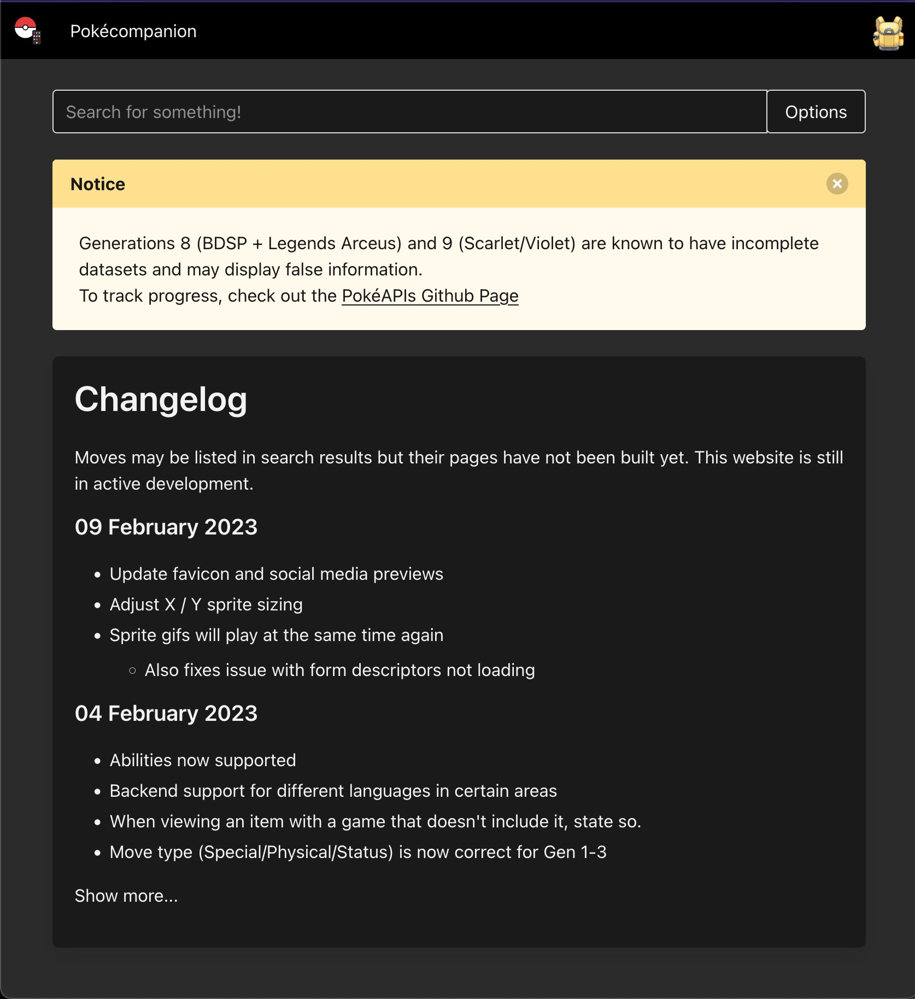
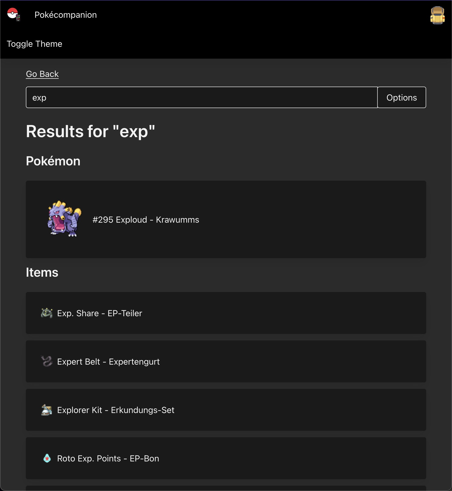
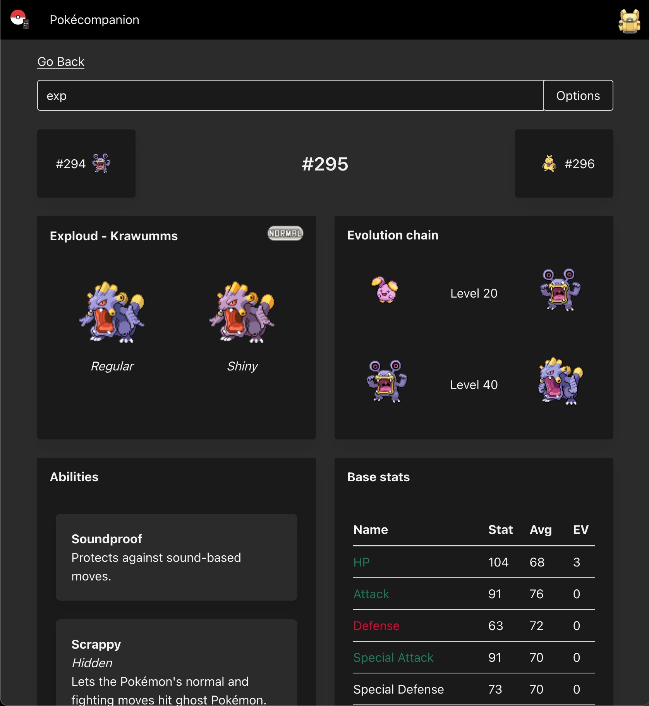
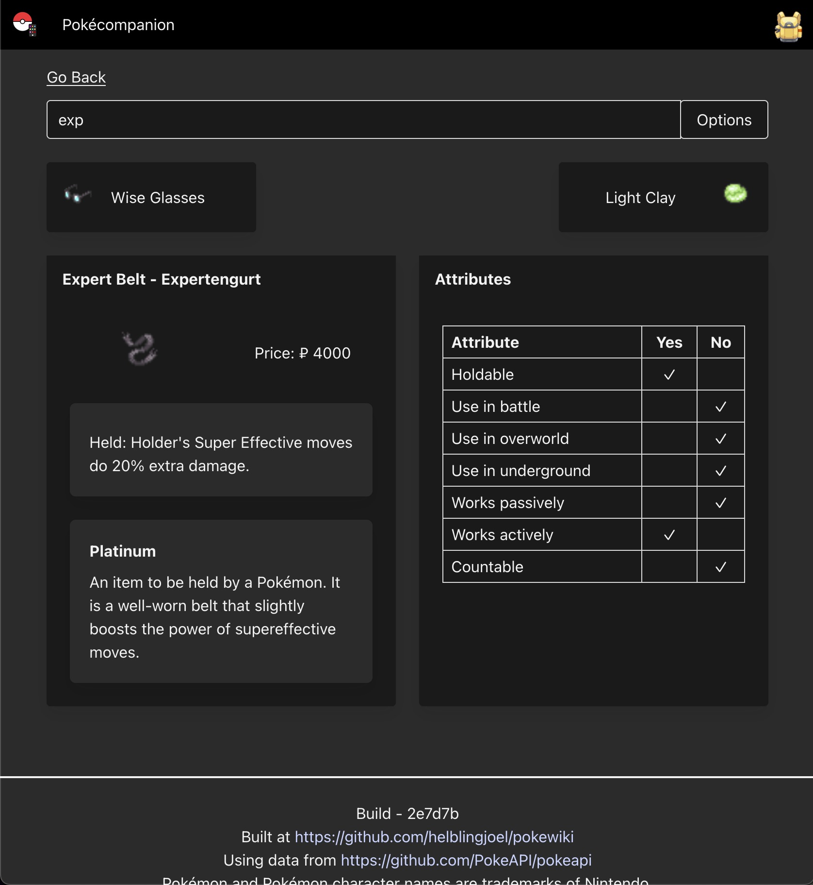
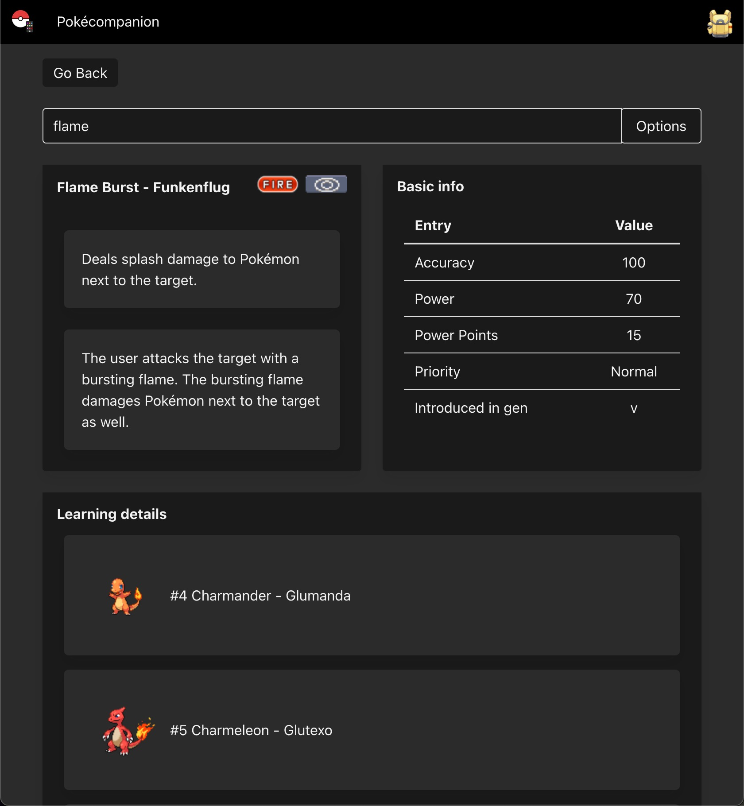

# Pokéwiki


<h4>The no-nonsense companion for your next Pokémon playthrough.</h4>
<a href="https://vercel.com/">
<a href="https://github.com/helblingjoel/pokewiki/commits/main"></a>
<a href="https://github.com/helblingjoel/pokewiki/commits/main"></a>
<div/>
<a href="https://pokemon.helbling.uk">pokemon.helbling.uk</a>

</br>

</br>

# Features

- Global search
- Only show game specific data
- Details about
  - Pokémon
  - Items
  - Moves
  - Abilities
- Multi language support\*

\*Work in progress

# Screenshots

| Home page                             | Search Result page                    |
| ------------------------------------- | ------------------------------------- |
|  |  |
| 2023-02-10                            | 2023-02-10                            |

| Pokemon page                            | Item page                   |
| --------------------------------------- | --------------------------- |
|   |  |
| Pokémon Platinum is selected 2023-02-10 | 2023-02-10                  |

| Move page                        | Ability page                           |
| -------------------------------- | -------------------------------------- |
|  |  |
| 2023-02-11                       | 2023-02-10                             |

## Developing

Assuming that <a href="https://nodejs.org/en/">Node</a> is installed on your system.

Install dependencies

```sh
# Install packages
npm install

# Install Typescript compiler
npm install tsc
```

To run a development build

```sh
npm run dev
```

To compile and run in production mode

```sh
# Compile
npm run prodbuild

# Run
npm run start
```
